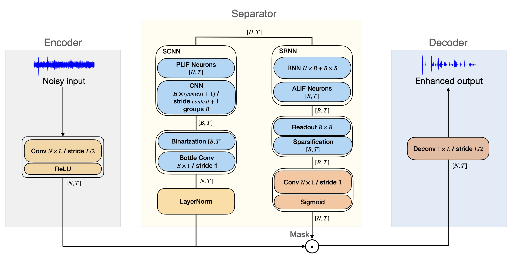

# DPSNN: Spiking Neural Network for Low-Latency Streaming Speech Enhancement

Inspired by the Dual-Path Recurrent Neural Network (DPRNN) in deep neural networks (DNNs), we develop a two-phase time-domain streaming SNN framework for speech enhancement, named Dual-Path Spiking Neural Network (DPSNN). DPSNNs achieve low latency by replacing the STFT and inverse STFT (iSTFT) in traditional frequency-domain models with a learned convolutional encoder and decoder.  In the DPSNN, the first phase uses Spiking Convolutional Neural Networks (SCNNs) to capture temporal contextual information, while the second phase uses Spiking Recurrent Neural Networks (SRNNs) to focus on frequency-related features. Evaluating on the Voice Cloning Toolkit (VCTK) Corpus and Intel N-DNS Challenge dataset, our approach demonstrates excellent performance in speech objective metrics, along with the very low latency (approximately 5 ms) required for applications like hearing aids.

## Architecture
The proposed DPSNN adopts the encoder-separator-decoder architecture. The encoder uses convolutions to convert waveform signals into 2D feature maps, effectively replacing the function of STFT. In the separator, a 2D mask is calculated, primarily relying on the SCNN and SRNN modules that capture the temporal and frequency contextual information of the encoded feature maps, respectively. In addition, threshold-based activation suppression, along with L1 regularization loss, is applied to specific non-spiking layers in DPSNNs to further improve their energy efficiency. After applying the calculated mask to the feature maps from the encoder, the decoder transforms the masked feature maps back to enhanced waveform signals.
<!-- &nbsp; -->

<!-- &nbsp; -->

If you use this code in an academic context, please cite our work:

```bibtex
@article{sun2024dpsnn,
  title={DPSNN: spiking neural network for low-latency streaming speech enhancement},
  author={Sun, Tao and Boht{\'e}, Sander},
  journal={Neuromorphic Computing and Engineering},
  volume={4},
  number={4},
  pages={044008},
  year={2024},
  publisher={IOP Publishing}
}
```

## Installation
Follow the steps in installation.txt.

## Training and Inference
```bash
cd egs/voicebank
# Training and testing
python -u vctk_trainer.py --config vctk.yaml -L 80 --stride 40 -N 256 -B 256 -H 256 --context_dur 0.01 --max_epochs 500 -X 1 --lr 1e-2
# Inference only
python -u vctk_trainer.py --config vctk.yaml -L 80 --stride 40 -N 256 -B 256 -H 256 --context_dur 0.01 --max_epochs 500 -X 1 --lr 1e-2 --test_ckpt_path ./epoch=478-val_loss=81.5449-val_sisnr=-18.4556.ckpt
```
The model file for this run can be found in *egs/voicebank/epoch=478-val_loss=81.5449-val_sisnr=-18.4556.ckpt*. Note that the model itself may differ slightly across different versions of PyTorch.

## Demos
Demos are in the <em>audio_demos</em> folder.